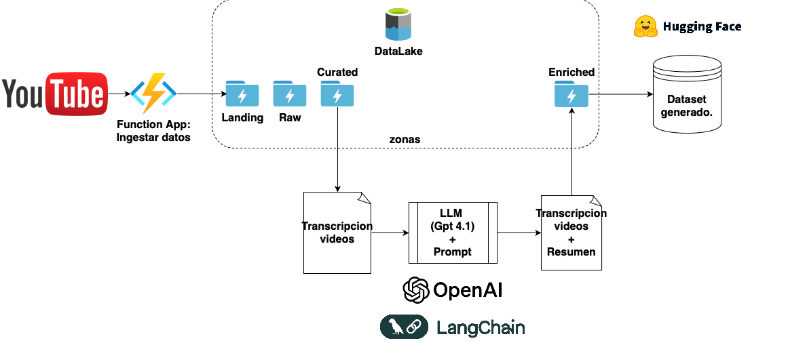
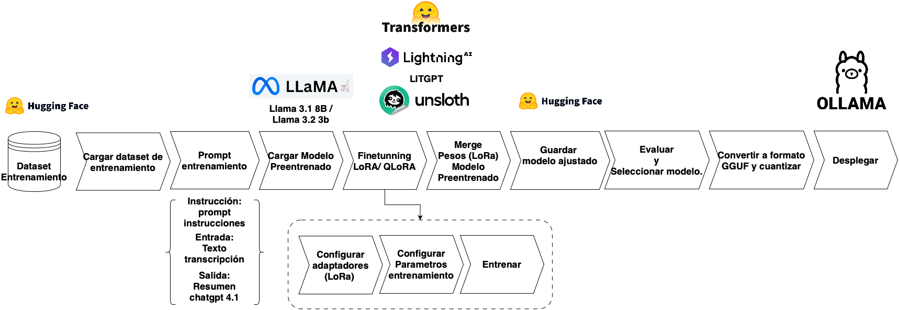
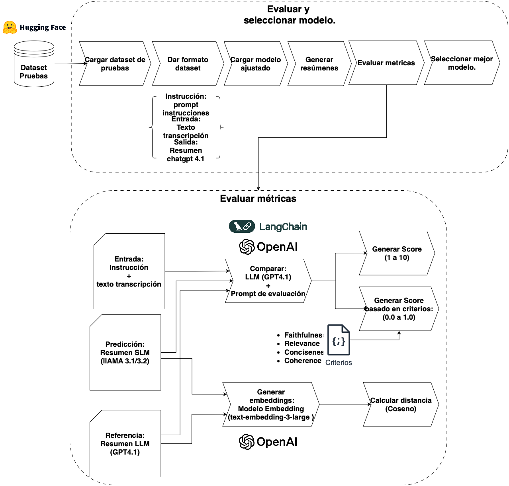
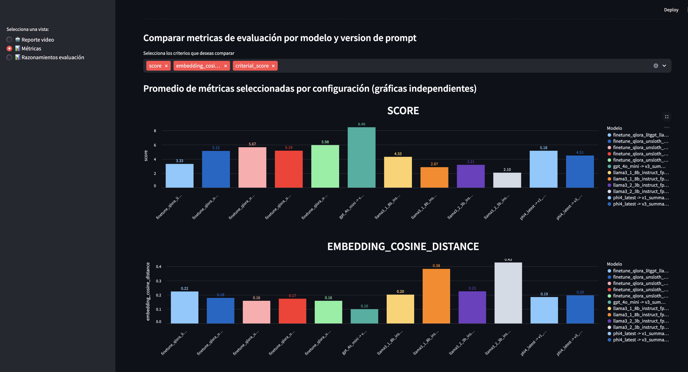
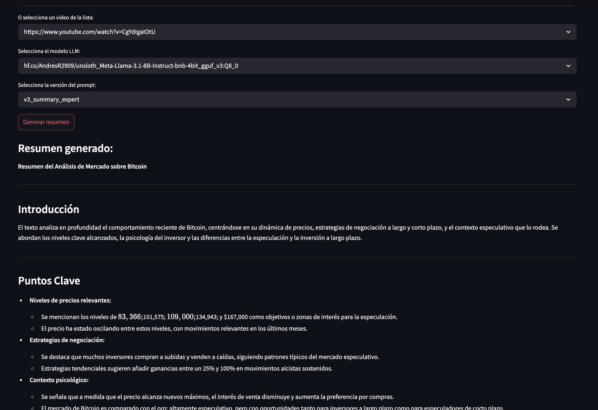

# POC Summary

Este proyecto contiene el código y notebooks que documentan las etapas de procesamiento, generación de datasets con resúmenes de transcripciones de videos y evaluación de resultados con SLMs para generar reportes estructurados a partir de videos de YouTube sobre análisis técnico y fundamental de trading.

---

## Tabla de Contenidos

- [Descripción General](#descripción-general)
- [Estructura del Proyecto](#estructura-del-proyecto)
- [Flujo de Trabajo](#flujo-de-trabajo)
- [Notebooks Principales](#notebooks-principales)
- [Modelos Finetuneados](#modelos-finetuneados)
- [Ejecución de la Interfaz](#ejecución-de-la-interfaz)
- [Seguimiento de Experimentos con MLflow](#seguimiento-de-experimentos-con-mlflow)

---

## Descripción General

El objetivo es ajustar modelos SLM (Small Language Models) como Llama 3.2-1B-3B y Llama 3.1-8B usando tecnicas PEFT como LoRA y QLoRA para generar resúmenes precisos y contextuales de transcripciones de videos, usando instrucciones específicas y un formato especifico de reporte. El pipeline incluye preprocesamiento, generación de datasets, fine-tuning, evaluación y despliegue.

---

## Estructura del Proyecto

```
app/
  main_interface.py         # Interfaz principal Streamlit
  llm/                     # Utilidades y wrappers para modelos de lenguaje
  preprocessing/
    etl_process.py         # Proceso ETL y preprocesamiento de datos
    data_preprocessing.py  # Funciones de limpieza y normalización
  prompts/                 # Prompts y plantillas para LLMs
  storage/
    blob_storage.py        # Manejo de blobs y almacenamiento
    data_lake_pandas.py    # Utilidades para Data Lake con pandas
    data_lake_storage.py   # Funciones de almacenamiento en Data Lake
data/
  ...                      # Datos de entrada y salida
notebooks/
  run_etl.ipynb                    # Pipeline ETL y preprocesamiento
  create_summaries.ipynb           # Generación de resúmenes con LLMs
  create_summaries_v2.ipynb
  summary_with_slm.ipynb           # Resúmenes con SLMs y prompts
  train_deploy_litgpt.ipynb        # Fine-tuning y despliegue de modelos
  Llama3_1_8B_transcriptions_summaries_v2.ipynb # Fine-tuning
  Llama3_1_8B_transcriptions_summaries_v2-2.ipynb # Fine-tuning
  evaluate_summary.ipynb           # Evaluación de resúmenes y métricas
  test_mlflow.ipynb                # Comparación de experimentos MLflow
requirements.txt
Readme.md
...

---

## Flujo de Trabajo

1. **Preprocesamiento y ETL:** Limpieza y normalización de transcripciones.
2. **Generación de Datasets:** Creación de resúmenes con LLMs grandes (GPT-4.1, GPT-4o) para usar como referencia y entrenamiento.



3. **Fine-Tuning:** Ajuste supervisado de SLMs con los datasets generados.



4. **Evaluación:** Comparación de resúmenes generados por SLMs vs. referencia usando métricas automáticas y evaluación con otro LLM.




5. **Despliegue y Uso:** Interfaz para generar resúmenes y tablero MLflow para seguimiento de experimentos.

---

## Notebooks Principales

- [`run_etl.ipynb`](notebooks/run_etl.ipynb):
  **Funcionalidad:** Preprocesamiento de datos de entrada, limpieza de textos y preparación del dataset.

- [`create_summaries.ipynb`](notebooks/create_summaries.ipynb) y [`create_summaries_v2.ipynb`](notebooks/create_summaries_v2.ipynb):
  **Funcionalidad:** Generación de resúmenes de transcripciones usando modelos LLM fundacionales (GPT-4o, GPT-4.1) para destilación de conocimiento.

- [`summary_with_slm.ipynb`](notebooks/summary_with_slm.ipynb):
  **Funcionalidad:** Generación de resúmenes con diferentes SLMs, prompts (zero/one shot) y modelos finetuneados.

- [`train_deploy_litgpt.ipynb`](notebooks/train_deploy_litgpt.ipynb):
  **Funcionalidad:** Fine-tuning supervisado de modelos Llama 3.2-1B y 3B usando LoRA y QLoRA, conversión de datasets a formato JSON, merge de pesos y despliegue.

- [`Llama3_1_8B_transcriptions_summaries_v2.ipynb`](notebooks/Llama3_1_8B_transcriptions_summaries_v2.ipynb)
- [`Llama3_1_8B_transcriptions_summaries_v2-2.ipynb`](notebooks/Llama3_1_8B_transcriptions_summaries_v2-2.ipynb)
**Funcionalidad:** Fine-tuning supervisado de modelos Llama 3.1-8B usando QLoRA mediante la libreria Unsloth para optimizar uso de memoria GPU, conversión de datasets a formato de instruccion, merge de pesos y despliegue en HF (se usaron do secuencias maximas de longitud 'max_seq_length'(8192 y 16384) ).

- [`evaluate_summary.ipynb`](notebooks/evaluate_summary.ipynb):
  **Funcionalidad:** Evaluación de resúmenes generados por SLMs usando métricas automáticas, embeddings y evaluación con otro LLM (GPT-4.1).

- [`test_mlflow.ipynb`](notebooks/test_mlflow.ipynb):
  **Funcionalidad:** Comparación de metricas de experimentos registrados en MLflow con diferentes modelos, prompts y ajustes finos (QLoRA).

---

## Modelos Finetuneados

- [llama-3.2-1b-finetuned_v5](https://huggingface.co/AndresR2909/hf-llama-3.2-1b-finetuned_v5)
- [llama-3.2-3b-finetuned_bnb_nf4_v2](https://huggingface.co/AndresR2909/hf-llama-3.2-3b-finetuned_bnb_nf4_v2)
- [unsloth_Meta-Llama-3.1-8B-Instruct-bnb-4bit_16bit_v3](https://huggingface.co/AndresR2909/unsloth_Meta-Llama-3.1-8B-Instruct-bnb-4bit_16bit_v3)
- [unsloth_Meta-Llama-3.1-8B-Instruct-bnb-4bit_16bit_v3](https://huggingface.co/AndresR2909/unsloth_Meta-Llama-3.1-8B-Instruct-bnb-4bit_16bit_v2)

Datasets en HuggingFace:
- [youtube_transcriptions_summaries_2025_gpt4.1](https://huggingface.co/datasets/AndresR2909/youtube_transcriptions_summaries_2025_gpt4.1)
- [youtube_transcriptions_summaries_2025_gpt4o](https://huggingface.co/datasets/AndresR2909/youtube_transcriptions_summaries_2025_gpt4o/)

---

## Ejecución de la Interfaz

Para correr la interfaz que permite generar resúmenes y obtener reportes de métricas:

1. Instalar ollama -> [link](https://ollama.com/)
2. Traer algunos modelos ajustados en formato gguf de huggingface (Revisa que cuantización segun los recursos de tu maquina)
```bash
ollama run hf.co/AndresR2909/unsloth_Meta-Llama-3.1-8B-Instruct-bnb-4bit_gguf_v3:Q8_0
ollama run hf.co/AndresR2909/unsloth_Meta-Llama-3.1-8B-Instruct-bnb-4bit_gguf_v3:Q4_K_M

```
3. instalar librerias
```bash
pip install -r requirements.txt
```
4. Ejecutar archivo interface grafica:

```bash
streamlit run app/main_interface.py
```








---

## Seguimiento de Experimentos con MLflow

Para lanzar el tablero de MLflow y visualizar los experimentos:

```bash
mlflow ui --port 5000
```
